# Message gallery

All 11 `ChatMessageKind` cases, with light and dark examples. Emoji are a text-message variant. The simulator samples below come from the demo’s Message Types screen; the custom-cell close-up uses a local SwiftUI fixture.

The gallery uses demo styling. See [Styles.md](../Styles.md) for the default library styles and customization options.

## Text and emoji

`.text(String)` — The demo includes incoming/outgoing text and enlarged emoji-only messages.

| Light | Dark |
|:---:|:---:|
| 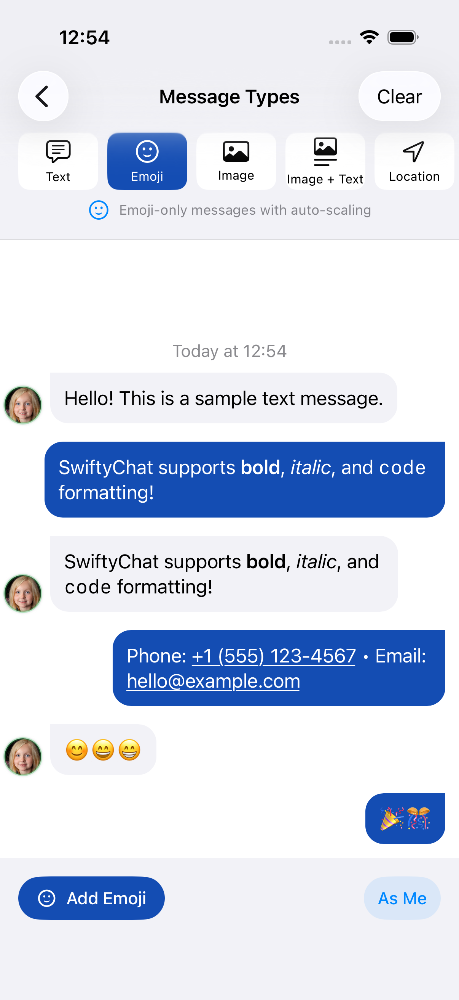 | 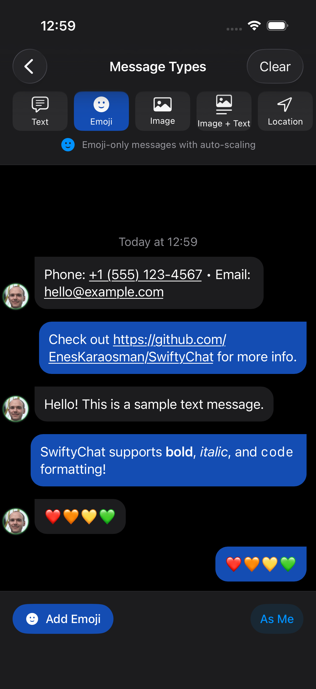 |

## Images

`.image(ImageLoadingKind)` — Local and remote images use the same message kind; these samples show remote photos.

| Light | Dark |
|:---:|:---:|
| 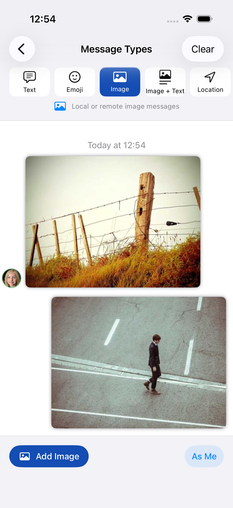 | 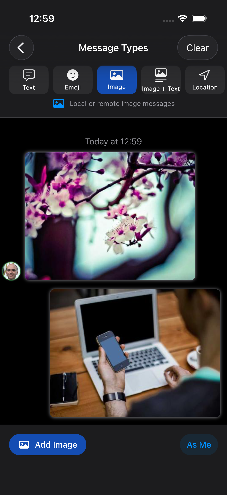 |

## Images with captions

`.imageText(ImageLoadingKind, String)` — The caption shares its card with the image and adapts to the system appearance.

| Light | Dark |
|:---:|:---:|
| 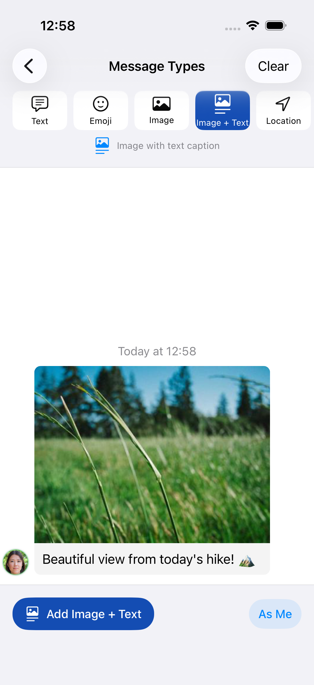 | 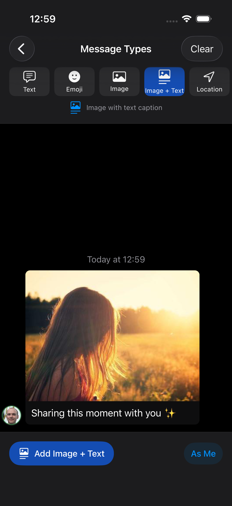 |

## Locations

`.location(LocationItem)` — A native MapKit view displays the supplied coordinates.

| Light | Dark |
|:---:|:---:|
| 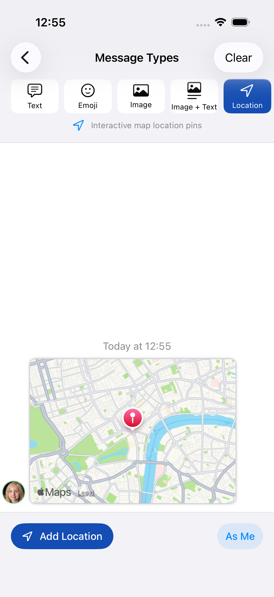 | 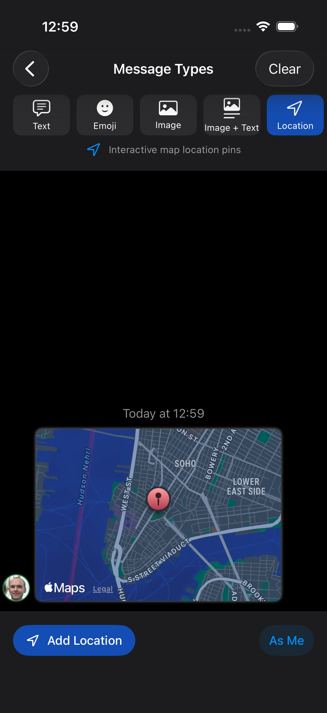 |

## Contacts

`.contact(ContactItem)` — The host app supplies contact actions. The demo shows Call and Text buttons.

| Light | Dark |
|:---:|:---:|
| 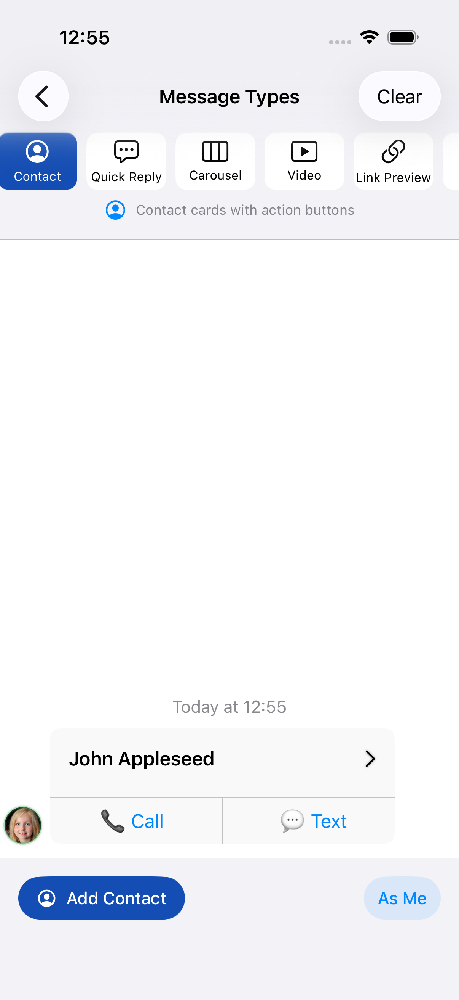 | 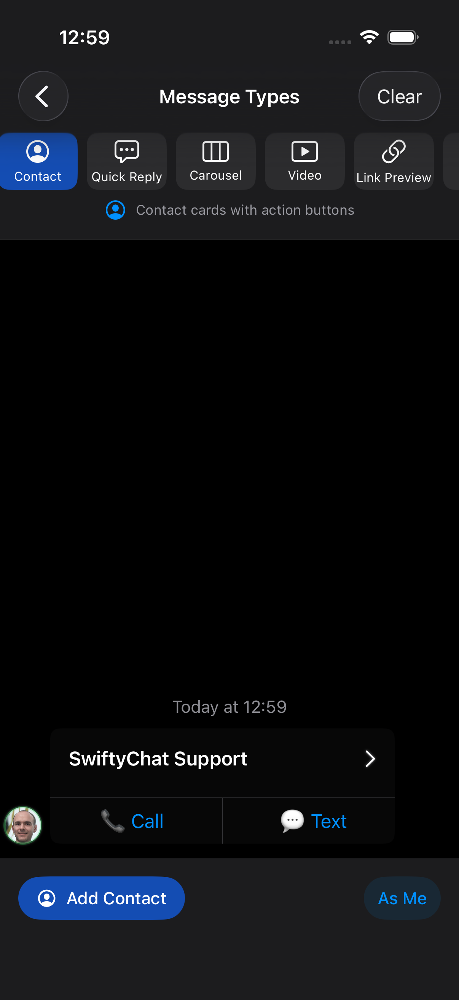 |

## Carousels

`.carousel([CarouselItem])` — Cards scroll horizontally and can contain multiple action buttons.

| Light | Dark |
|:---:|:---:|
| 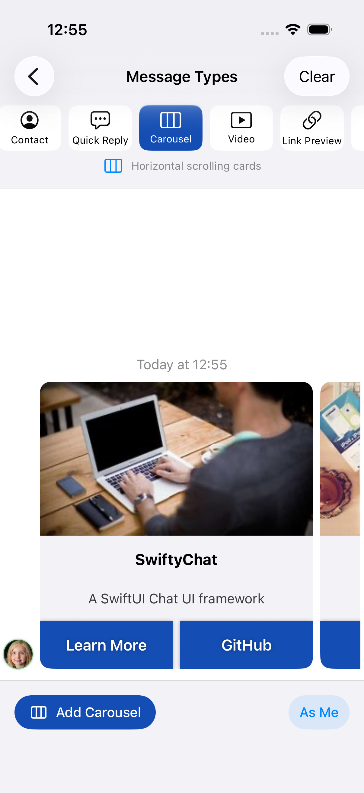 | 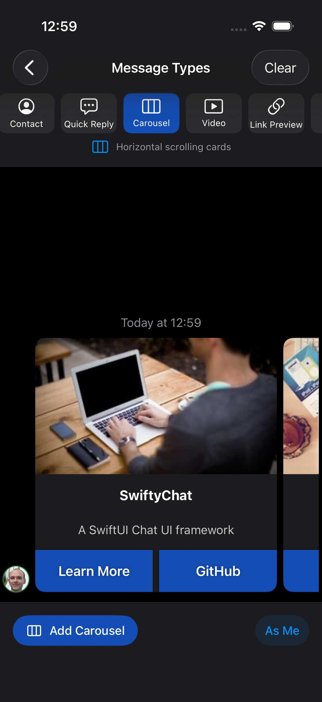 |

More context: [carousel in a conversation · light](Images/carousel-light.png) · [dark](Images/carousel-dark.png).

## Video

`.video(VideoItem)` — The thumbnail opens video playback; this still image shows the play control.

| Light | Dark |
|:---:|:---:|
| 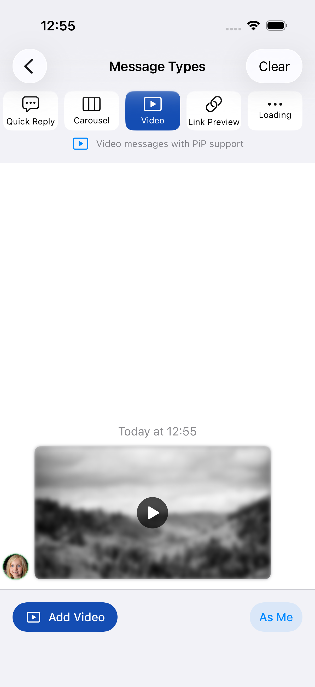 | 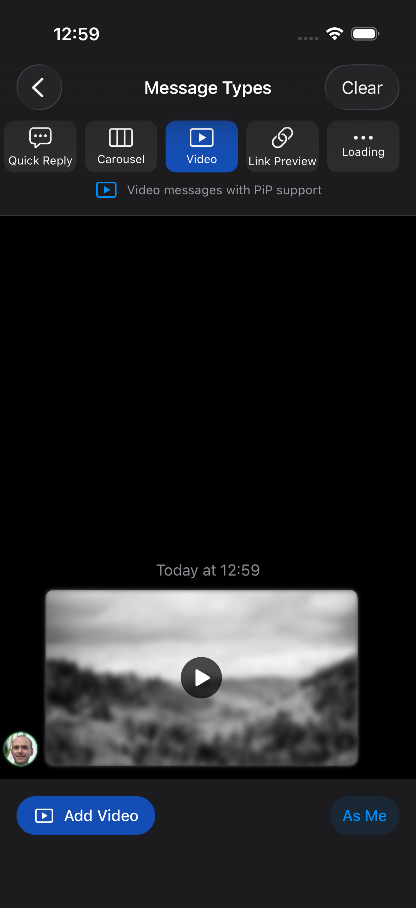 |

## Link previews

`.linkPreview(LinkPreviewItem)` — The host supplies the displayed metadata and handles taps.

| Light | Dark |
|:---:|:---:|
| 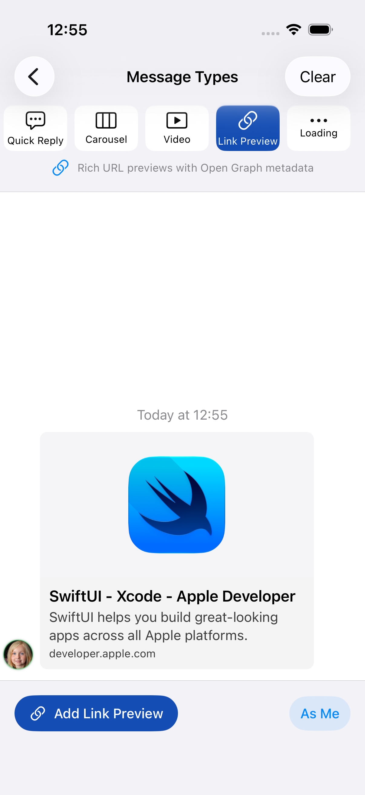 | 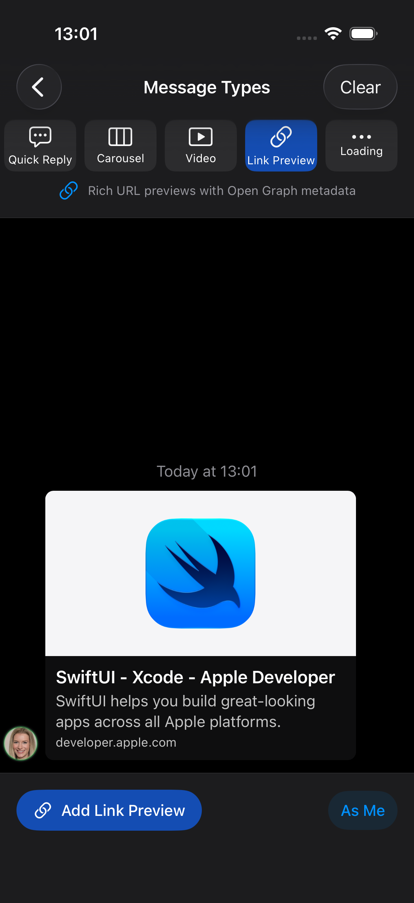 |

## Quick replies

`.quickReply([QuickReplyItem])` — The selected set is disabled after selection; a new set remains available.

| Light | Dark |
|:---:|:---:|
| 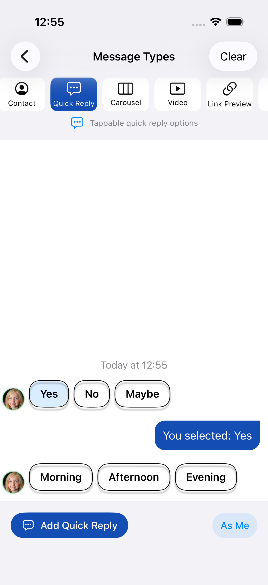 | 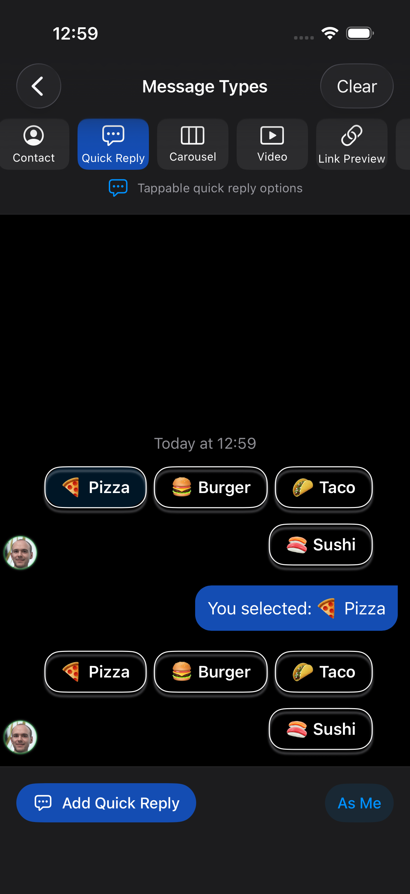 |

More context: [guided conversation · light](Images/conversation-light.png) · [dark](Images/conversation-dark.png).

## Loading

`.loading` — The three-dot indicator animates in the running app; this is a still capture.

| Light | Dark |
|:---:|:---:|
| 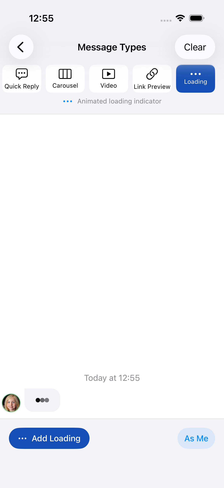 | 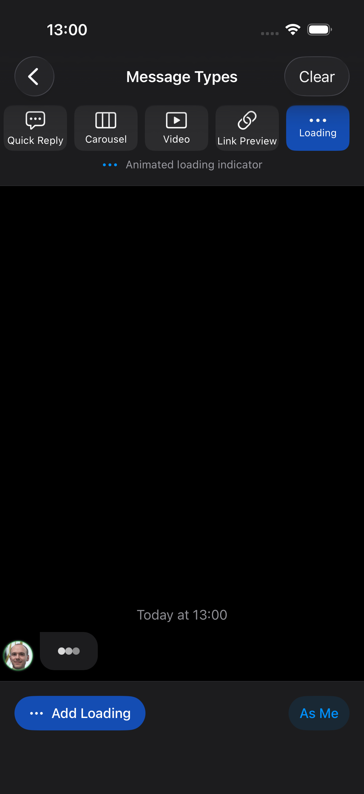 |

## Custom content

`.custom(Any)` — This local fixture is rendered from the library. Register any SwiftUI view with `registerCustomCell`; see [CustomMessage.md](../CustomMessage.md).

| Light | Dark |
|:---:|:---:|
| 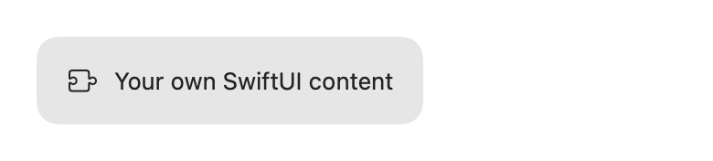 |  |

## Capture these examples

Run `Tests/Screenshots/components.yaml` through Maestro with `OUTPUT_DIR` and `APPEARANCE`, or use the [full capture script](Appearance.md#refresh-documentation-assets). Samples are generated by the demo, so text, photos, contacts, and coordinates can differ between runs. Review remote image and map loading before publishing.
