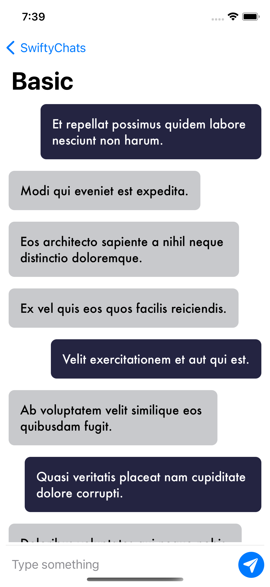
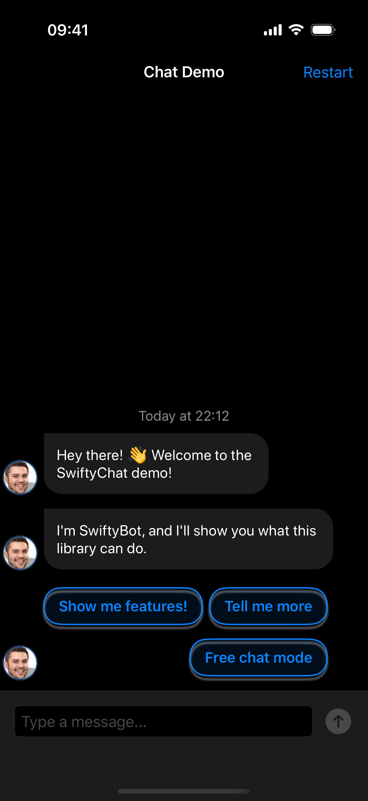
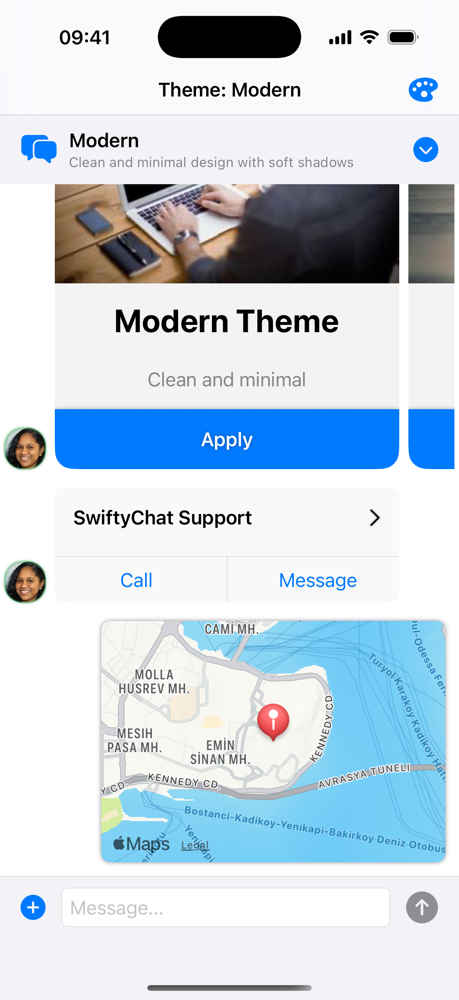
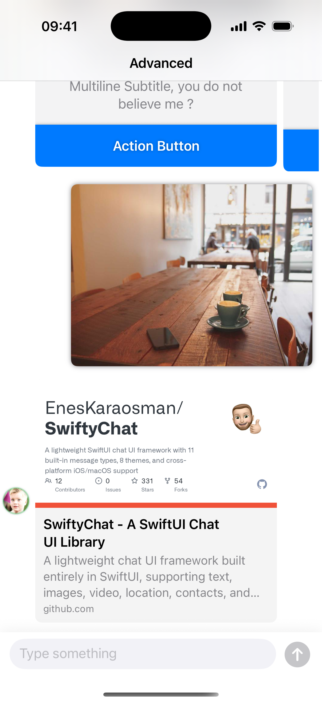
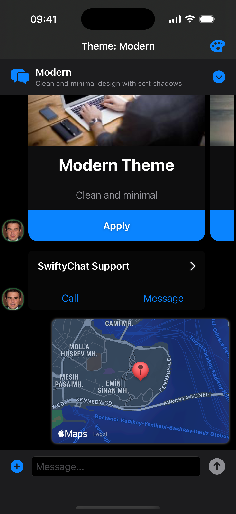
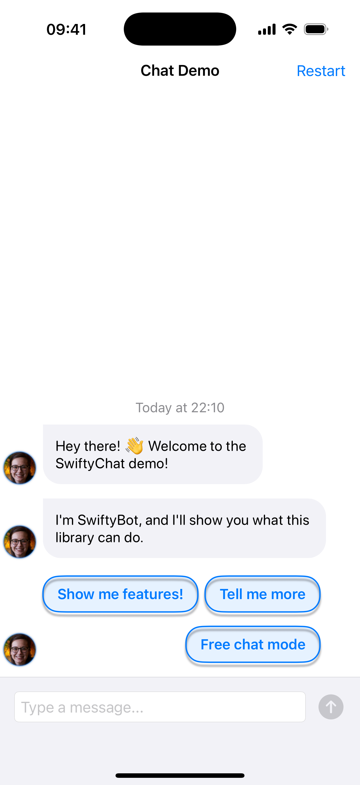

<p align="center">
  
</p>

<h1 align="center">SwiftyChat</h1>

<p align="center">
  <strong>A lightweight, cross-platform SwiftUI chat UI framework.<br/>Perfect for AI chatbots, customer support, and messaging apps.</strong>
</p>

<p align="center">
  <a href="https://github.com/EnesKaraosman/SwiftyChat/stargazers"></a>
  <a href="https://github.com/EnesKaraosman/SwiftyChat/network/members"></a>
  
  
  
  <a href="https://swiftpackageindex.com/EnesKaraosman/SwiftyChat"></a>
  <a href="LICENSE"></a>
</p>

<p align="center">
  <a href="#installation">Installation</a> •
  <a href="#quick-start">Quick Start</a> •
  <a href="#message-kinds">Message Types</a> •
  <a href="#pre-built-themes">Themes</a> •
  <a href="#ai--chatbot-use-case">AI & Chatbot</a> •
  <a href="CustomMessage.md">Custom Cells</a>
</p>

---

Also available for [Flutter](https://github.com/EnesKaraosman/swifty_chat).

## Why SwiftyChat?

- **11 built-in message types** — text, image, video, location, carousel, quick replies, link previews, contacts, loading indicators, and more
- **8 pre-built themes** with full style customization via SwiftUI environment
- **Cross-platform** — iOS 17+ and macOS 14+ from a single codebase
- **High performance** — O(n) complexity, cached formatters, async image loading
- **Chatbot-ready** — carousels, quick replies, and loading states designed for AI/bot interfaces
- **Lightweight** — just 2 dependencies (Kingfisher + SwiftUIEKtensions)
- [Custom message cells](CustomMessage.md) for any type you need
- Landscape orientation support with auto-scaling cells
- User avatars with configurable positioning
- Keyboard dismiss on tap and scroll
- Scroll to bottom or to a specific message
- Picture-in-Picture video playback
- Per-corner rounding on text bubbles
- Multiline input bar ([BasicInputView](Sources/SwiftyChat/InputView/BasicInputView.swift))
- Attributed string / markdown support

## Preview

| Light | Dark | Theme Showcase |
|:---:|:---:|:---:|
|  |  |  |

<details>
  <summary>More screenshots</summary>

  | Advanced Features | Theme (Dark) | Chatbot Demo |
  |:---:|:---:|:---:|
  |  |  |  |

</details>

## Installation

### Swift Package Manager

Add SwiftyChat in Xcode via **File → Add Package Dependencies**:

```
https://github.com/EnesKaraosman/SwiftyChat.git
```

Or add it to your `Package.swift`:

```swift
dependencies: [
    .package(url: "https://github.com/EnesKaraosman/SwiftyChat.git", from: "4.1.0")
]
```

## Quick Start

```swift
import SwiftyChat

struct ContentView: View {
    @State private var messages: [YourMessage] = []
    @State private var message = ""
    @State private var scrollToBottom = false

    var body: some View {
        ChatView(messages: $messages, scrollToBottom: $scrollToBottom) {
            BasicInputView(
                message: $message,
                placeholder: "Type something",
                onCommit: { messageKind in
                    messages.append(/* your message */)
                }
            )
        }
        .environment(\.chatStyle, ChatMessageCellStyle())
    }
}
```

> `YourMessage` must conform to the `ChatMessage` protocol (which has an associated `ChatUser` type). See the [SwiftyChatDemo app](SwiftyChatDemo) for a complete implementation.

## Message Kinds

```swift
public enum ChatMessageKind: CustomStringConvertible {
    case text(String)              // Auto-scales for emoji-only messages
    case image(ImageLoadingKind)   // Local (UIImage/NSImage) or remote (URL)
    case imageText(ImageLoadingKind, String) // Image with caption
    case location(LocationItem)    // MapKit pin
    case contact(ContactItem)      // Shareable contact card
    case quickReply([QuickReplyItem]) // Tappable options, auto-disables after selection
    case carousel([CarouselItem])  // Scrollable cards with buttons
    case video(VideoItem)          // Video with PiP support
    case linkPreview(LinkPreviewItem) // Rich URL preview with Open Graph metadata
    case loading                   // Animated loading indicator
    case custom(Any)               // Your own message type
}
```

## Customization

### Input View

A built-in `BasicInputView` is included. Use it as-is, or build your own — `ChatView` accepts any view via its `inputView` closure.

### Styling

Every visual aspect is customizable through `ChatMessageCellStyle` — text styles, edge insets, avatar styles, and cell styles for every message type. Inject via `.environment(\.chatStyle, yourStyle)`. All properties have sensible defaults.

See [Styles.md](Styles.md) for the full style reference and [CustomMessage.md](CustomMessage.md) for custom cell types.

## Pre-built Themes

| Theme | Description |
|-------|-------------|
| **Modern** | Clean blue, minimal design |
| **Classic** | Traditional green messaging |
| **Dark Neon** | Cyberpunk with neon pink accents |
| **Minimal** | Subtle gray tones |
| **Ocean** | Calming teal, sea-inspired |
| **Sunset** | Warm orange gradients |
| **Nature** | Fresh green, eco-friendly |
| **Lavender** | Soft purple, relaxing |

See `ThemeShowcaseView` in the SwiftyChatDemo app for live demos.

## AI & Chatbot Use Case

SwiftyChat is especially well-suited for AI and chatbot interfaces. Built-in support for carousels, quick reply buttons, loading indicators, and link previews means you can build a rich conversational UI without custom cells:

```swift
// Show a loading indicator while the AI responds
messages.append(Message(user: bot, messageKind: .loading))

// Replace with the actual response
messages[messages.count - 1] = Message(
    user: bot,
    messageKind: .text("Here's what I found...")
)

// Offer follow-up options as quick replies
messages.append(Message(
    user: bot,
    messageKind: .quickReply([
        QuickReplyItem(title: "Tell me more"),
        QuickReplyItem(title: "Something else"),
    ])
))
```

Building a ChatGPT-style app, a customer support bot, or an in-app assistant? SwiftyChat gives you the UI layer so you can focus on the AI logic.

## Contributing

Contributions are welcome! Whether it's a bug fix, new feature, documentation improvement, or a new theme — we'd love your help.

See [CONTRIBUTING.md](CONTRIBUTING.md) for guidelines.

## Acknowledgments

Inspired by [MessageKit](https://github.com/MessageKit/MessageKit) (UIKit) and [Nio](https://github.com/niochat/nio) (SwiftUI).

## License

SwiftyChat is available under the Apache 2.0 license. See the [LICENSE](LICENSE) file for details.
