# Style reference

`ChatMessageCellStyle` controls the appearance of each message kind. Inject it with `.environment(\.chatStyle, style)`. Its defaults work on light and dark system backgrounds; custom colors should be checked in both appearances.

## System appearance

Use semantic colors such as `.primary` for text on adaptive surfaces. Set foreground and background together when using a fixed fill. SwiftyChat inherits the host app's appearance and does not force a color scheme.

```swift
let style = ChatMessageCellStyle(
    incomingTextStyle: TextCellStyle(
        textStyle: CommonTextStyle(textColor: .primary),
        cellBackgroundColor: .secondary.opacity(0.1),
        cellCornerRadius: 16
    ),
    outgoingTextStyle: TextCellStyle(
        textStyle: CommonTextStyle(textColor: .white),
        cellBackgroundColor: Color(red: 0.08, green: 0.30, blue: 0.70),
        cellCornerRadius: 16
    ),
    imageTextCellStyle: ImageTextCellStyle(
        textStyle: CommonTextStyle(textColor: .primary)
    )
)
```

Test your host view with `.environment(\.colorScheme, .light)` and `.environment(\.colorScheme, .dark)` in previews. For a deliberately dark presentation with a fixed dark canvas, apply `.preferredColorScheme(.dark)` to that presentation so native controls, sheets, and semantic colors agree.

### Current defaults

The following samples are rendered from the library with local fixture content. They show the default styles, while the simulator screenshots below show the demo's custom styles.

| Component | Light | Dark |
|---|:---:|:---:|
| Text with links |  | 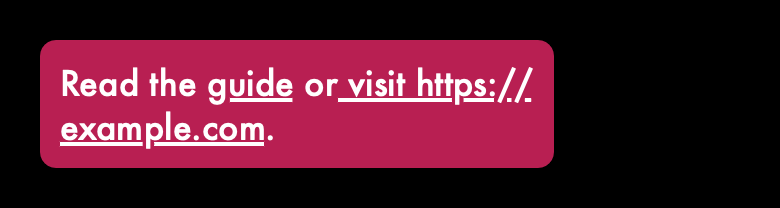 |
| Image caption |  |  |
| Quick replies | 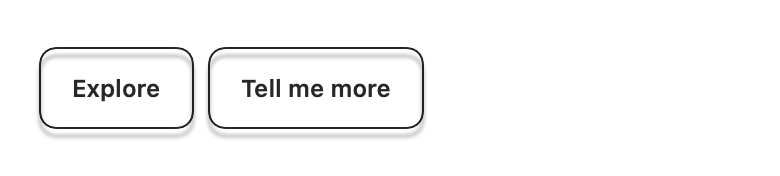 | 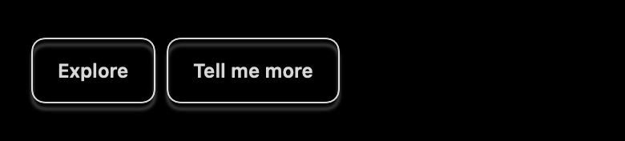 |
| Link preview | 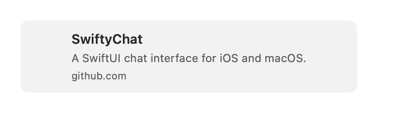 | 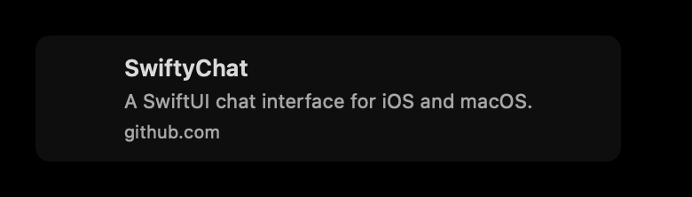 |
| Video thumbnail | 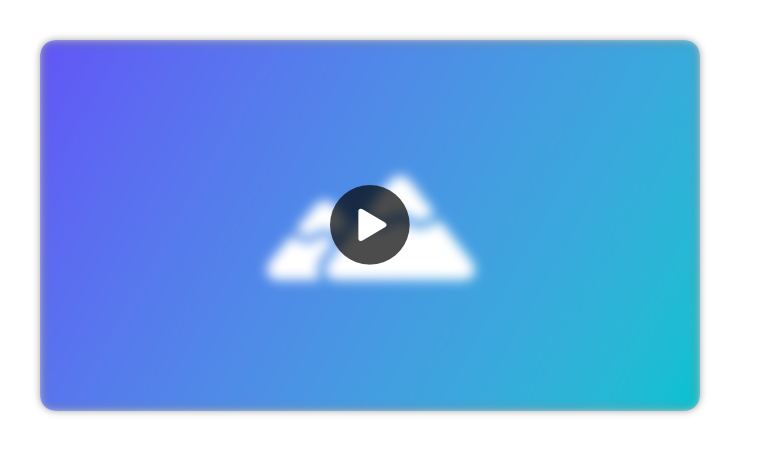 | 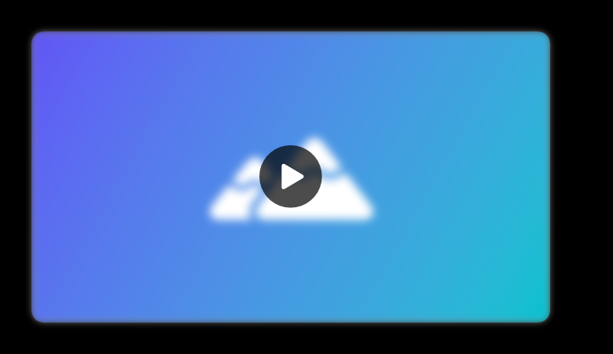 |
| Active video | 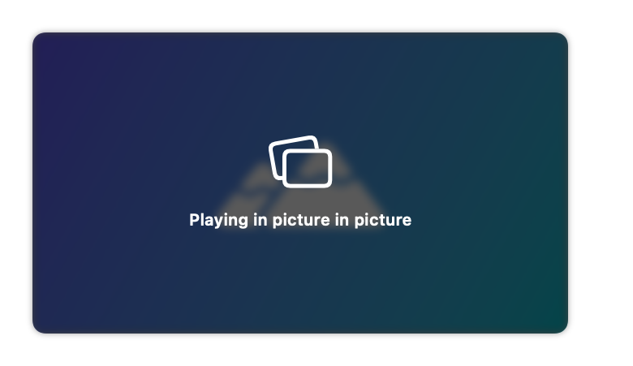 | 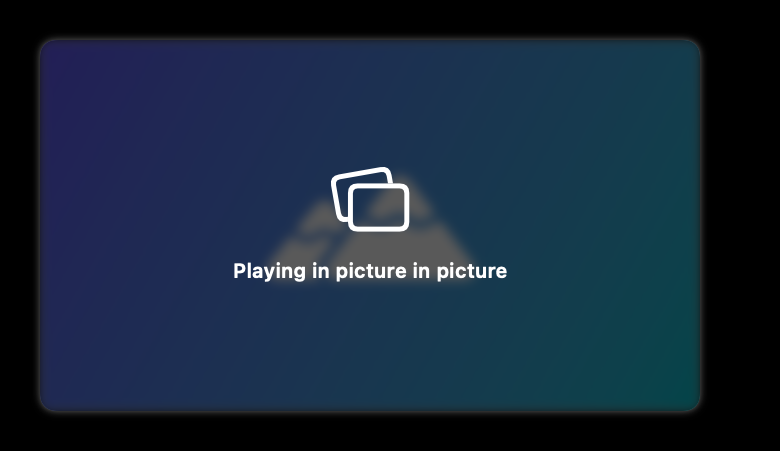 |
| Reply quote | 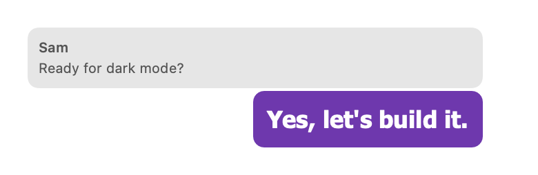 | 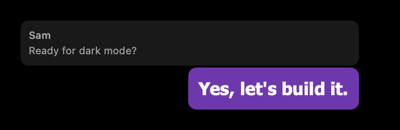 |

<details>
<summary>More default components</summary>

| Component | Light | Dark |
|---|:---:|:---:|
| Text | 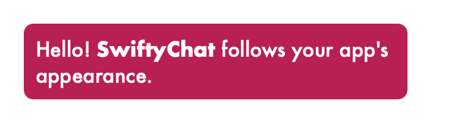 | 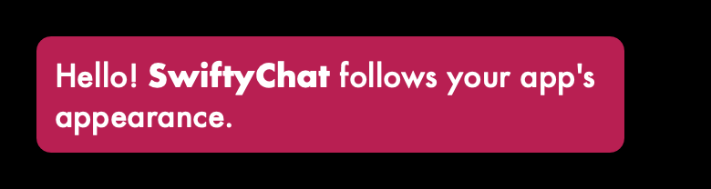 |
| Emoji | 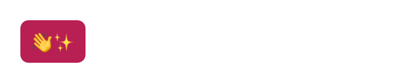 | 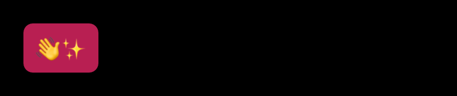 |
| Image | 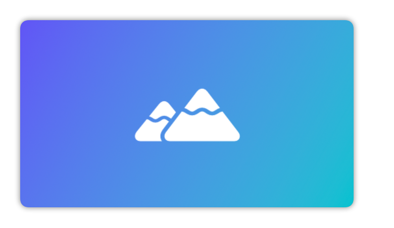 | 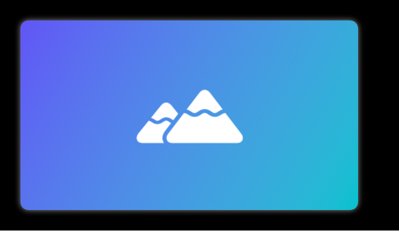 |
| Contact without actions | 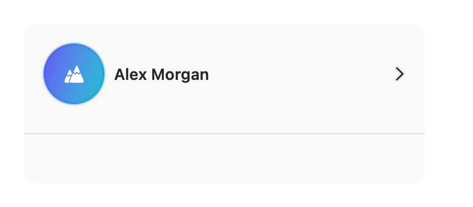 | 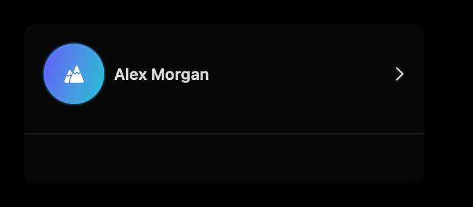 |
| Loading | 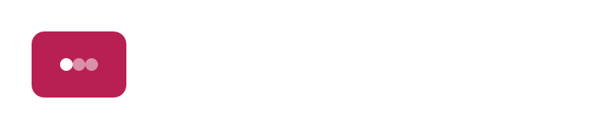 | 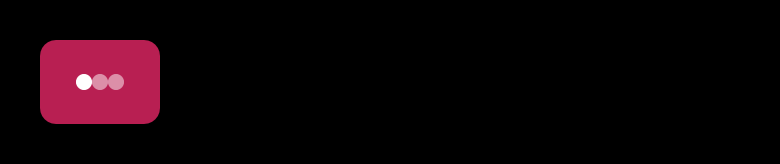 |
| Custom content |  |  |

</details>

## Style types

Follow the source links for the complete, current initializer defaults.

| Style | Controls |
|---|---|
| [ChatMessageCellStyle](Sources/SwiftyChat/Styles/ChatMessageCellStyle.swift) | Incoming/outgoing text, message insets, per-kind styles, and avatars |
| [TextCellStyle](Sources/SwiftyChat/Styles/TextCellStyle.swift) | Font, foreground, padding, fill, selected corners, border, and shadow |
| [QuickReplyCellStyle](Sources/SwiftyChat/Styles/QuickReplyCellStyle.swift) | Selected/unselected colors and fonts, item size, border, and shadow; replies wrap to the available width |
| [CarouselCellStyle](Sources/SwiftyChat/Styles/CarouselCellStyle.swift) | Card width, title/subtitle styles, action foreground/background, and card decoration |
| [ImageCellStyle](Sources/SwiftyChat/Styles/ImageCellStyle.swift) | Image width, corners, border, and shadow |
| [ImageTextCellStyle](Sources/SwiftyChat/Styles/ImageTextCellStyle.swift) | Image card with caption text style and padding |
| [LocationCellStyle](Sources/SwiftyChat/Styles/LocationCellStyle.swift) | Map width, aspect ratio, corners, border, and shadow |
| [ContactCellStyle](Sources/SwiftyChat/Styles/ContactCellStyle.swift) | Card width, contact image, name style, and decoration |
| [AvatarStyle](Sources/SwiftyChat/Styles/AvatarStyle.swift) | Image style and alignment to the message's top, center, or bottom |
| [VideoPlaceholderCellStyle](Sources/SwiftyChat/Styles/VideoPlaceholderCellStyle.swift) | Thumbnail width, aspect ratio, blur, and decoration |
| [LinkPreviewCellStyle](Sources/SwiftyChat/Styles/LinkPreviewCellStyle.swift) | Title, description, host, image height, text padding, and card decoration |

Width closures receive the available chat size. Use that size when customizing layout so it works in split views, resized macOS windows, and device rotation.

```swift
let images = ImageCellStyle(cellWidth: { size in
    min(size.width * 0.75, 420)
})
```

## Demo themes

The demo includes five presets in [ChatThemes.swift](SwiftyChatDemo/SwiftyChatDemo/Themes/ChatThemes.swift). These are examples you can copy into your app, not exported library presets.

| Theme | Palette | Appearance |
|---|---|---|
| Modern | Blue with rounded bubbles | Follows the system |
| Classic | Blue with simple messaging bubbles | Follows the system |
| Dark Neon | Cyan on a dark canvas | Explicitly dark |
| Warm Sunset | Orange accents and deep orange action fills | Follows the system |
| Nature | Green accents and deep green action fills | Follows the system |

| Modern · light | Modern · dark | Dark Neon · light system |
|:---:|:---:|:---:|
| 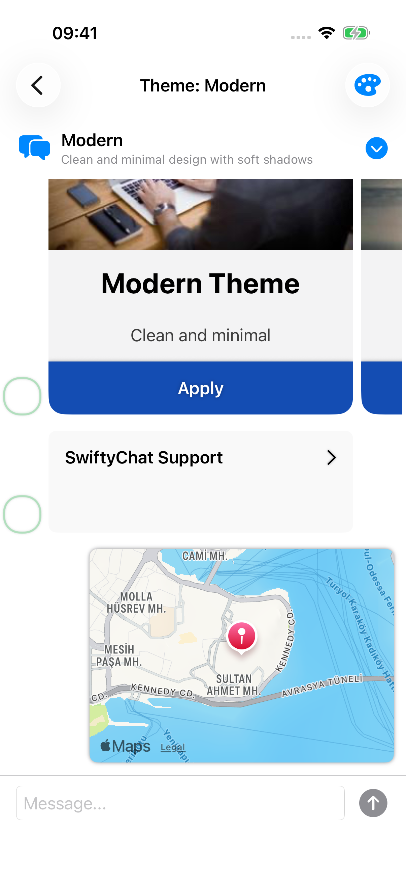 | 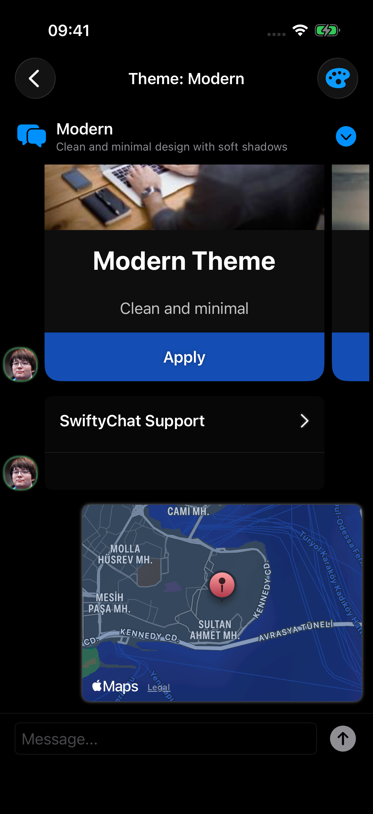 |  |

<details>
<summary>Classic, Warm Sunset, and Nature in both appearances</summary>

| Theme | Light | Dark |
|---|:---:|:---:|
| Classic | 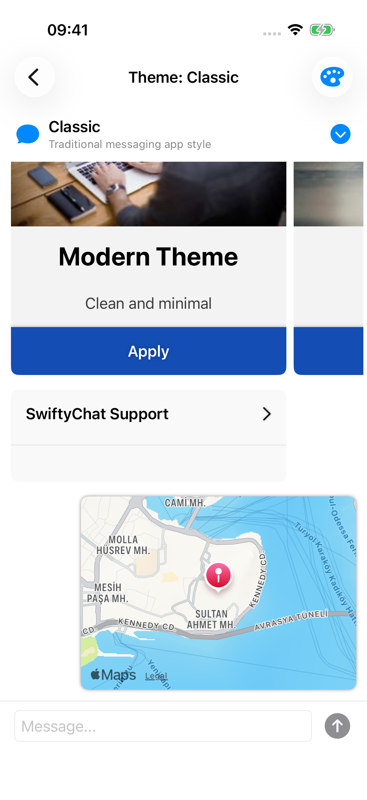 | 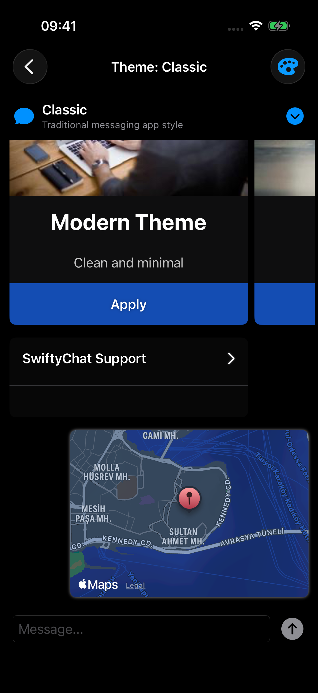 |
| Warm Sunset | 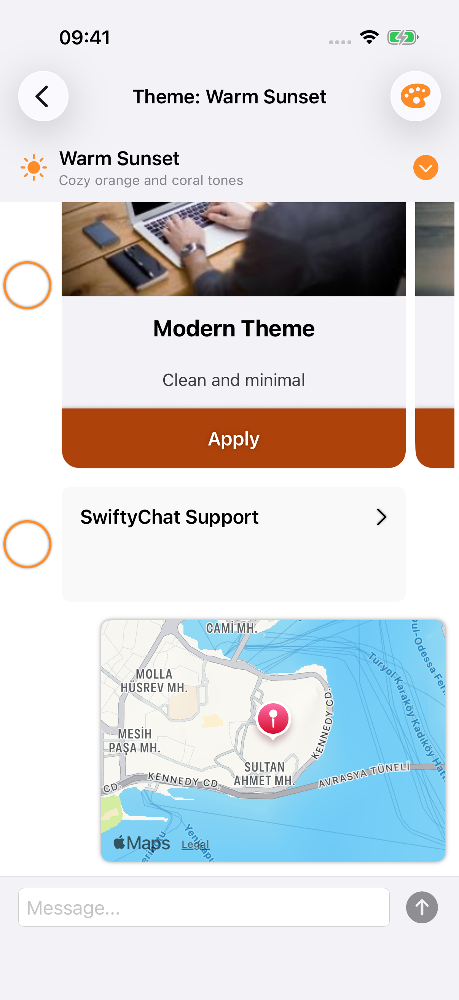 | 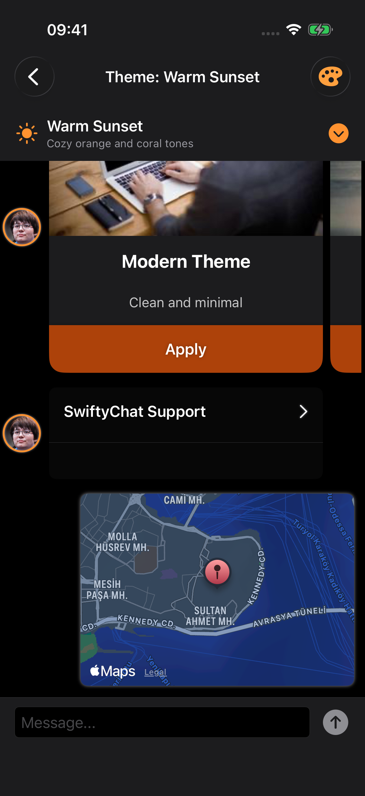 |
| Nature | 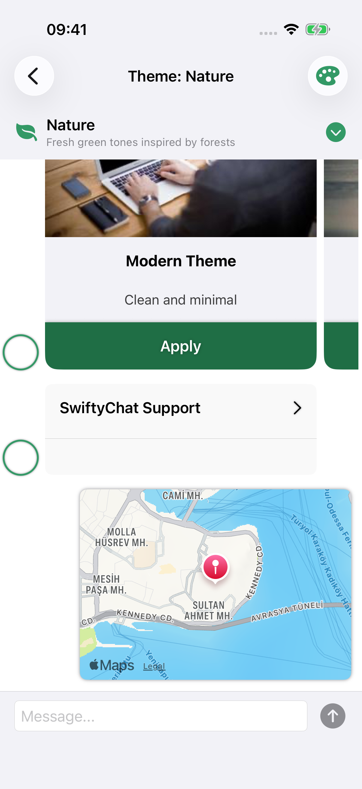 | 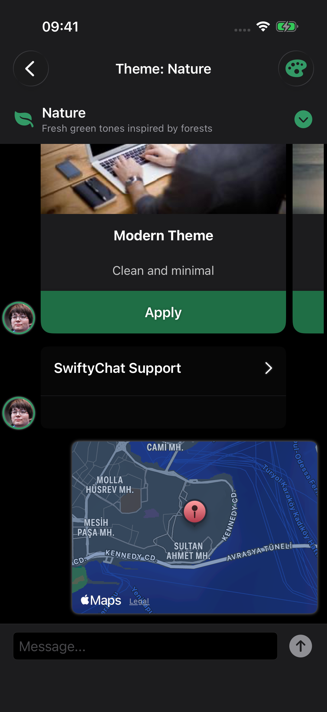 |

</details>

## Native controls

Carousels, MapKit maps, text fields, and contact actions are checked in the running demo. SwiftUI's `ImageRenderer` does not render every native control, so the component render tests do not cover those controls.

| Contact actions · light | Contact actions · dark | Caption · light |
|:---:|:---:|:---:|
|  |  |  |

The input stays above the software keyboard without moving messages over the theme header:

| Keyboard · light | Keyboard · dark |
|:---:|:---:|
| 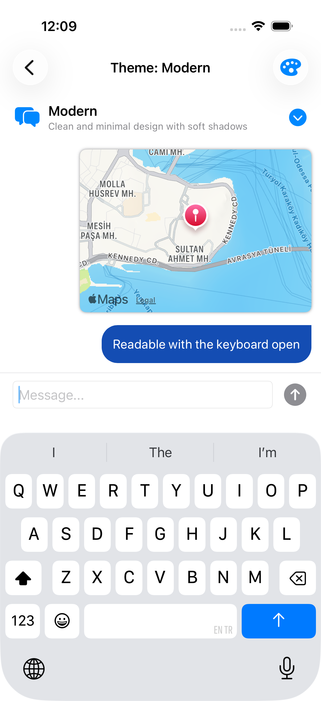 | 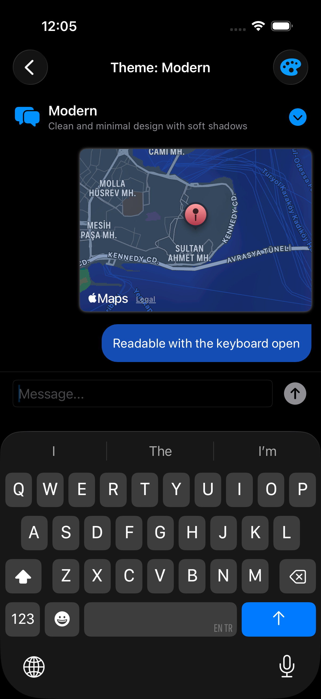 |

More native captures: [caption in dark mode](Documentation/Images/gallery-caption-dark.png), [video in light mode](Documentation/Images/gallery-video-light.png), [video in dark mode](Documentation/Images/gallery-video-dark.png), and [Dark Neon with a dark system appearance](Documentation/Images/theme-neon-dark.png).

See [appearance testing and asset capture](Documentation/Appearance.md) to reproduce the screenshots and checks.
